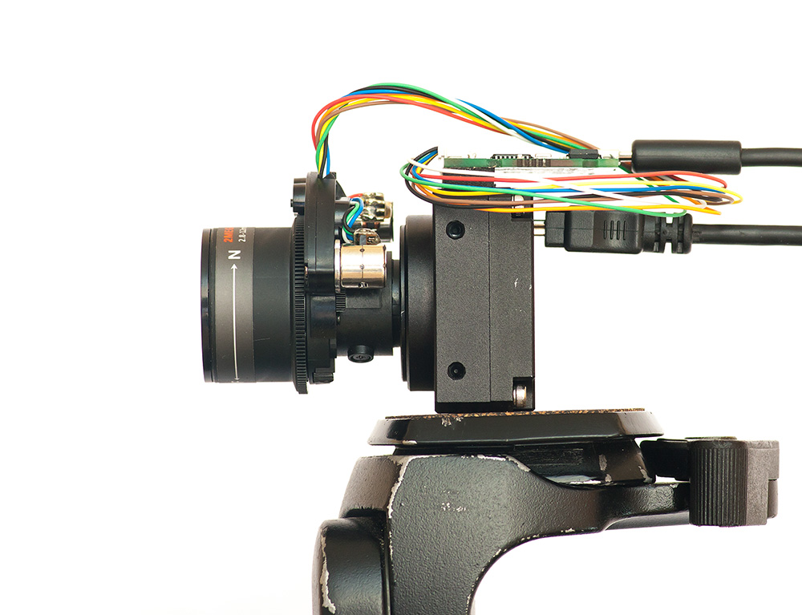

### Python

1. Install pyqt:
  * https://www.riverbankcomputing.com/software/pyqt/download
  * Install OpenCV 3.0

2. Install python packages:
  * pip install enum34
  * pip install pyserial

### Images

### Arduino IDE setup
  * I was developing on Arduino IDE version 1.6.4, but should work on newer. 
  * Tools -> Board -> "Arduino Nano"
  * Tools -> Processor -> "Atmega328"
  * Tools -> Port -> Chose one you are using

### Commands
#### G0
Move motors to new position
   
Example [G0 X100 Y100] - to move motors to new position

#### G92
Set position to defined

Example [G92 X0 Y0] - to set current position as 0

#### M0 
Instant stop

Example [M0]

#### M98
Experimental set motor power

Example [M98 R1]
 * R1 -> 33% (default)
 * R2 -> 50%
 * R3 -> 67%
 * R4 -> 100%

#### M99
Experimental set movement speed

Example [M99 R100], default R=600, The smaller value, the faster motion
