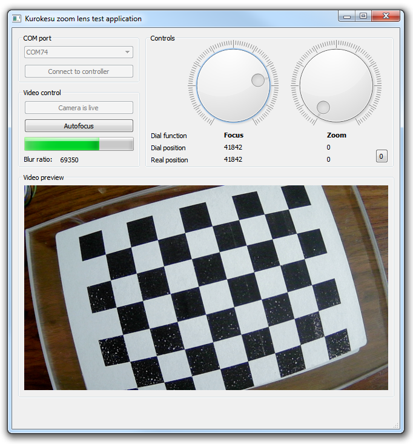

### Python

1. Install pyqt:
  * https://www.riverbankcomputing.com/software/pyqt/download
  * Install OpenCV 3.0

2. Install python packages:
  * pip install enum34
  * pip install pyserial

### Images

